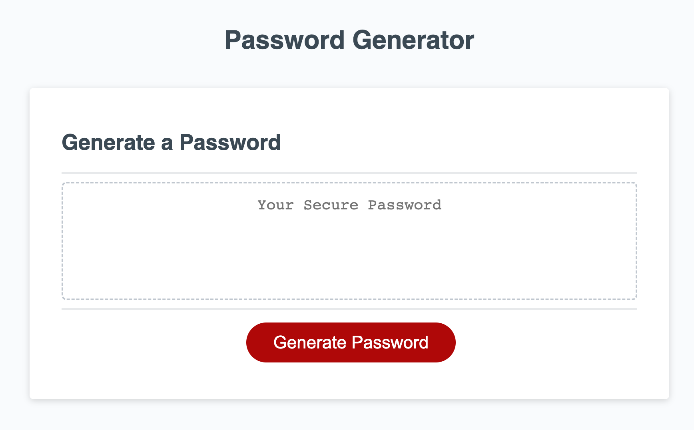
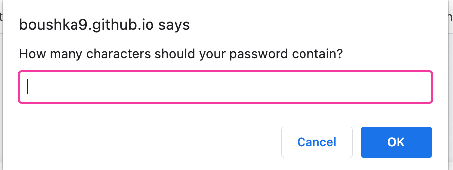
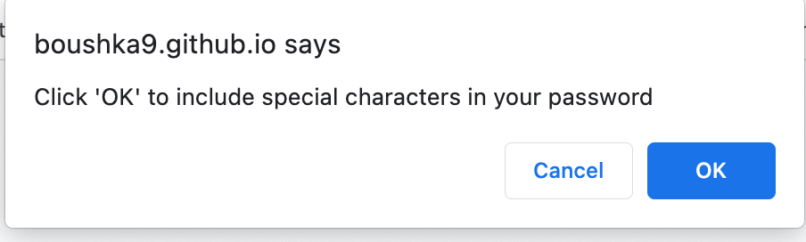
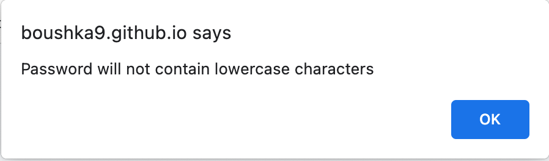

# Password Generator 

## Description
The purpose of this project was to create a basic customizable password generator by allowing the user to determine what criteria they want to include in their password. Based on their chosen criteria, the user will see their password appear on the screen. The features that allow the user to choose what character types to include in their password were created with basic JavaScript such as window prompts, alerts, and confirm messages. The features that print a randomized password onto the screen for the user were created using JavaScript variables, functions, for loops, and methods such as Math.random() and Math.floor().

## Installation

No installation is necessary for this application. Visit https://boushka9.github.io/bird-of-paradise/ to access the deployed project.

## Usage

Open the deployed site at https://boushka9.github.io/bird-of-paradise/ 

When it first loads you will see a text box where your password will apear as well as a 'Generate Password' button.

Click the 'Generate Password' button to begin selecting your password criteria.

First, a window prompt will open requesting a number input to determine your passwords length.

If you enter a anything other than a number, or number lower than 8 or higher than 128 you will receive an error alert and need to re-click 'Generate Password" to start again.
After you have successfully entered your desired password length, you will be shown a series of window messages asking if you want to include special characters, uppercase letters, lowercase letters, or numbers in your password. 
To include a character type, click 'Confirm'.

If you do not wish to include a character type, click 'Cancel'. You will then receive a confirmation that that character type will not be included in your password. Click 'OK' to continue.

## Credits

The following resources were used to build this project:

https://dev.to/sanchithasr/7-ways-to-convert-a-string-to-number-in-javascript-4l

https://www.w3resource.com/javascript-exercises/javascript-array-exercise-35.php

https://stackoverflow.com/questions/5915096/get-a-random-item-from-a-javascript-array

https://www.w3schools.com/jsref/jsref_concat_array.asp

https://www.w3schools.com/jsref/jsref_push.asp

## License
MIT 

---

